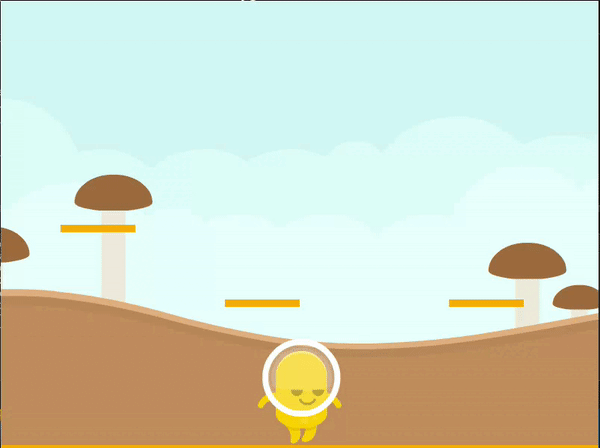
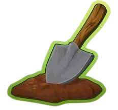
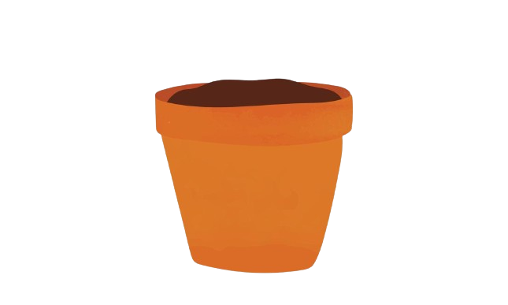
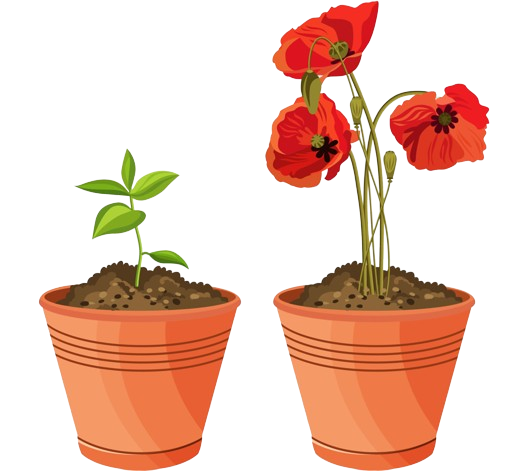
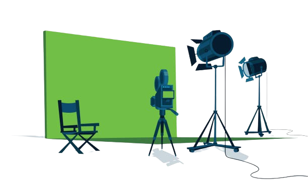
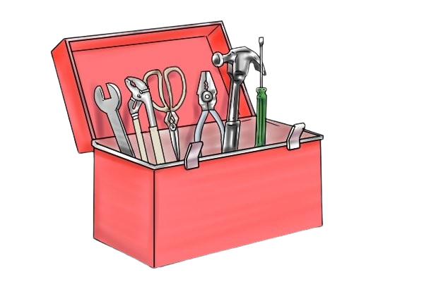
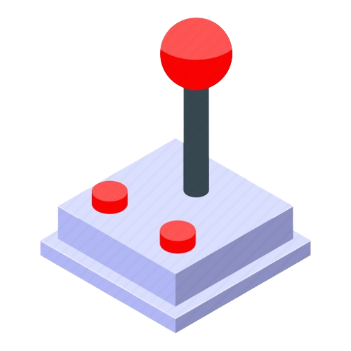
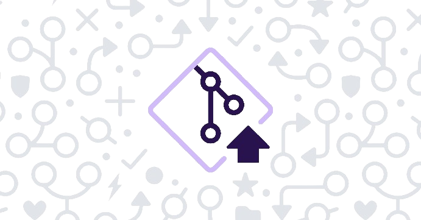

<picture>
 <source media="(prefers-color-scheme: dark)" srcset="https://github.com/Jaamblico/TallerRaspi/assets/15118493/0d20e14c-949c-4a8c-8764-11642132e364">
 <source media="(prefers-color-scheme: light)" srcset="https://github.com/Jaamblico/TallerRaspi/assets/15118493/0d20e14c-949c-4a8c-8764-11642132e364">
 
</picture>

# Taller de Videojuegos con Python y Raspberry Pi

## Introducción a la programación mediante código en la Raspberry Pi

En este taller se propone una introducción al diseño de videojuegos y a la programación con Python desde una Raspberry Pi. El mismo se complementa con los talleres de [Narrativas no Lineales](https://docs.google.com/presentation/d/1gBIHfYmq7jOo9Yg4-tv1tXL-XLvuvCOaUr7McVtxBJ0/edit?usp=sharing) y el de [Exploración de la placa Raspberry Pi](https://docs.google.com/presentation/d/1HZ0GHMZ_pe09u6gWEd8VEuLeG-s0_oNr-_CQm0VxHXk/edit?usp=drive_link). 

Para poder llevar adelante nuestro taller, haremos uso de múltiples herramientas que listamos a continuación:
+ [GitHub](https://github.com/): Una plataforma para alojar nuestros proyectos y trabajar de forma colaborativa con otros programadores. **Requisito crearse una cuenta**
+ [Google Colab](https://colab.research.google.com/drive/1D40Dv4HyaZIHxj4kKqnhPLD8LP4f2RDE#scrollTo=pRAYol7gySdK): Una plataforma que nos permitirá introducirnos al mundo de Python ejecutando código directamente desde el navegador sin necesidad de descargar entornos de programación específicos. 
+ [PyGameZero](https://pygame-zero.readthedocs.io/en/stable/): La librería que usaremos para construir nuestro videojuego en Python, basada en PyGame.
+ Un editor de código como el [IDLE](https://docs.python.org/es/3/library/idle.html) preinstalado en el sistema operativo de la Raspberry o [MU](https://codewith.mu/en/about) el cuál debe ser instalado. 
+ [GPIO Zero](https://gpiozero.readthedocs.io/en/stable/): La librería que utilizaremos para interactuar con los pines de nuestra Raspberry y conectar los componentes electrónicos necesarios para construir un joystick para nuestro juego.

## Syllabus

1) Preparación del Entorno

+ Comandos de consola en Raspbian (Linux) para crear la estructura de archivos del proyecto

+ Comandos de GitHub para: configurar la cuenta, clonar el ropositorio remoto y crear una rama.

2) Exploración de Ejemplos

+ Lectura del código (python + Pygame Zero) de los ejemplos descargados.
+ Modificación de aspectos visuales de los ejemplos usando VIM.

3) Montaje de aspectos visuales

+ Descarga del [Pack de Recursos](https://kenney.nl/assets/platformer-art-deluxe#inline-download).
+ Creación del boceto en lápiz y papel.
+ Creación del código en Pygame Zero para cargar los assets descargados.

4) Mecánica y Comportamientos del juego

+ Creación de las funciones para la movilidad del personaje (desplazamientos y gravedad).
+ Creación de las funciones para interactuar con el entorno (colisiones y final del juego).

5) Construcción del Joystick

+ Ensamblado del Joystick utilizando componentes electrónicos básicos (protoboard, cables y botones).
+ Conexión del Joystick a la RaspberryPi siguiendo el [esquema de pines GPIO](https://europe1.discourse-cdn.com/arduino/original/4X/0/1/8/01850d7ef20a1357cca734fa27bd628925122a87.png).
+ Creación de la función para implementar el Joystick dentro del juego.

6) Actualización del repositorio remoto con el local

+ Agregado de cambios: "git commit".
+ Cambio de la rama personal a la rama principal: "git checkout main".
+ Subida de los cambios locales al repositorio remoto: "git push".

